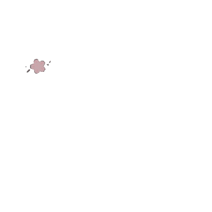

  

  

<!-- Animated Header -->

---

<h3 align="center">🎲 Try your luck!</h3>

  

---

<h1 align="center">✨ Hajimemashite (はじめまして) ✨</h1>

Hi, I'm <b>Nurhalimah</b> — (❁´◡`❁) 
A passionate learner exploring the world of software engineering, currently studying <b>Full-Stack Software Engineering</b> at <b>RevoU (Batch Paris)</b>.
I love creating clean, functional, and user-friendly web applications.

---

## 🧠 Tech & Skills Overview

<table>
  <tr>
    <td valign="top">
      <h4>💻 Programming Languages</h4>
      

        
        
        
        
      

    </td>
    <td valign="top">
      <h4>🛠️ Tools</h4>
      

        
        
      

    </td>
    <td valign="top">
      <h4>🗄️ Databases</h4>
      

        
      

    </td>
    <td valign="top">
      <h4>🤝 Soft Skills</h4>
      <ul>
        <li>Teamwork & Independence</li>
        <li>Time Management</li>
        <li>Adaptability</li>
        <li>Creativity</li>
      </ul>
    </td>
  </tr>
</table>

---

## 🎓 Education
- 🎓 Full-Stack Software Engineering — RevoU *(Batch Paris)*  
- 💻 Bachelor's Degree in Computer Science — Universitas Nusa Mandiri  

---

## 🚀 Projects Showcase

### 📂 Group Final Project — Semesta Kata
> Created as part of the **Software Engineering Program at RevoU**  
🔗 [View Project](https://drive.google.com/file/d/15QxDIf0uOh-V-vT0suLzw5R73Y_vd0vO/view?usp=sharing)

### 📂 Final Project — RevoBank
> Developed in the **RevoU Software Engineering Program**  
🔗 [View Repository](https://github.com/nuyucrutt/RevoBank)

### 📂 Project Milestone 1 — nhartikel
> My first step in learning at **RevoU**  
🔗 [Visit Website](https://nhartikel.my.id/)

---

## 📫 Contact Me

| Platform | Link |
|-----------|------|
| 📧 **Gmail** | [nuyha1221@gmail.com](mailto:nuyha1221@gmail.com) |
| 📸 **Instagram** | [@nuyucrutt](https://www.instagram.com/nuyucrutt/) |
| 💼 **LinkedIn** | [Nurhalimah](https://www.linkedin.com/in/nurhalimah-9304521b0/) |

---

<h3 align="center">🌸 Thanks for Visiting 🌸</h3>

    
  

---

  
   
  

